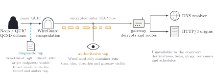
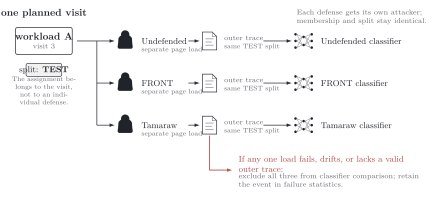

# Capture Methodology

## Research question and observer

This lab asks whether a QCSD defence creates a distinguishable encrypted QUIC
time/direction/size trace while preserving the requested application content.
It uses one observer for every workload and defence: Ethernet capture on the
client container's `eth0`.



*Figure 1: The direct observer records the exact union of Neqo endpoint tuples.
The PCAP is internal; the normalized trace contains only relative time,
direction, frame length, and signed frame length. [TikZ
source](docs/diagrams/threat-model.tex).*

The direct observer sees the same traffic shape available to a passive host- or
edge-network observer, but the internal PCAP also retains origin addresses,
ports, QUIC Initial packets, and other metadata. It is therefore valid mechanism
and classifier-input evidence but is not, by itself, a privacy-sanitized release
artifact.

The classifier-facing sequence may contain only:

- time relative to the first retained packet;
- outgoing or incoming direction;
- observed Ethernet `frame.len`;
- the equivalent signed length.

Plaintext, keys, qlogs, runner events, endpoint identifiers, response hashes,
resolved parameters, and schedules are prohibited classifier features. Loads
are sequential and the observer is assumed to know the sample boundary.

The normalized CSV already omits address and port fields. A future public corpus
still requires a separately specified anonymization/export boundary; this lab
does not describe raw PCAP as sanitized.

## Workloads, visits, and splits

- A **workload** is one frozen request graph.
- A **planned visit** is one configured repetition of that graph.
- A **defence sample** is one independent load under one defence.
- A **paired visit** is the samples for one workload/repetition across every
  configured defence.
- A **split group** is one frozen 70/15/15 train/validation/test assignment
  shared by every derivative of the same source-manifest digest and repetition.



*Figure 2: A visit expands into seven separately captured loads with a common
artifact contract and split. [TikZ source](docs/diagrams/dataset-flow.tex).*

A sample is operationally eligible only when Neqo reports a complete successful
response for every resource, its direct capture validates, and its response
signature equals the undefended member of the paired visit. Fidelity
eligibility is separate: the sample must also pass the declared realization
gates in `fidelity.yml`. Headline cross-defence and classifier populations use
the intersection of complete operationally and fidelity-eligible seven-way
pairs. Attempts and failures remain in operational statistics.

A deterministic hash assignment freezes 70% train, 15% validation, and 15%
test groups before collection. Its key is
`split_group_id = H(source_manifest_sha256, repetition)`; the campaign split
seed then determines the assignment. Workload aliases, request policies,
replay scopes, network conditions, campaign stages, defence selections,
retries, and derived artifacts cannot move the same underlying graph and
repetition across partitions. The separate physical `visit_id` binds the
chosen alias, policy, scope, and on-disk audit layout; it is not the leakage
boundary. A later genuinely time-separated evaluation remains distinct from
this split.

Monitored and unmonitored roles are properties of workload classes. Closed-
and open-world evaluation are views of the same captured visits, not separate
collection workflows.

### Simple and complex graphs

The campaign scope is manifest preprocessing:

```text
as-defined           retain the reviewed graph as written
primary-origin       retain only the final-page origin
all-reviewed-origins retain the reviewed cross-origin graph
```

The resolved graph then enters the same planner, Neqo runner, direct collector,
validator, plotter, report, and sealer. A one-resource graph and a multi-origin
graph both produce one `direct-quic.pcapng` containing the exact union of their
endpoint tuples and one normalized `direct-quic.csv`.

Repetition counts are always explicit in campaign YAML. A scope does not imply
a sample count or a separate runtime.

Chromium is used only to discover candidate page dependencies. A reviewer
allowlists origins, Neqo probes retained requests for HTTP/3 availability, and
repeated undefended preflight checks status, delivered bytes, and body hashes.
The measured sample is then performed by Neqo/QCSD alone.

## Capture boundary

For every sample:

```text
dumpcap start → Neqo page load → defence tail → settle interval → dumpcap stop
```

The raw capture begins with a bounded `udp` BPF so the client port need not be
predicted. After `run.json` exists, the retained PCAP is filtered to the exact
bidirectional local/remote endpoint tuples. It is not trimmed using qlogs or
application events. The PCAP remains in its original record order. Its
classifier-facing trace is ordered chronologically by capture timestamp, with
original record order used only as a stable tie-breaker for equal timestamps;
this accounts for capture buffers flushing records a few microseconds out of
timestamp order without rewriting the raw evidence.

Validation requires:

- one direct observer on `eth0`, Ethernet link type, `frame.len`;
- a nonempty PCAP below the configured size bound;
- the number of runner endpoints to match the resolved origin count;
- every packet to be attributable to a recorded endpoint tuple;
- direction to be client-relative and reproducible;
- the normalized CSV to reproduce exactly from PCAPNG;
- every runner datagram to reconcile to a direct frame with one uniform clock
  offset and at most 10 ms residual;
- the runner, workload, seed, defence, parameter, and response bindings to
  agree.

A host realtime step or VM pause can make the capture clock discontinuous
relative to the runner's monotonic clock. Such an attempt is retained as failed
evidence and retried within the configured limit. It is not corrected
piecewise, admitted with a looser threshold, or promoted into classifier data.

GRO, GSO, TSO, and UDP segmentation offload state before and after the
collector's disable attempt is recorded. QCSD direct-capture sockets also
disable Linux `UDP_GRO`; interface settings alone do not disable that
per-socket receive coalescing. Controlled acceptance origins disable the
interface offloads on their own virtual interfaces as well, preventing a
bridge-observed segmentation aggregate from being misclassified as one
oversized UDP datagram. The configured ceiling is checked against every
locally built Initial, Handshake, and Application Data datagram, while the
peer's advertised maximum immediately caps the effective PLPMTU. Capture
limits, retry limits, cooldowns, and source/image provenance are sealed.

## Canonical visual evidence

The canonical per-visit figure is the original two-row direct-PCAP comparison:

1. deterministic Gaussian packet-time density for outgoing and incoming
   observed frames, with recorded controller schedule actions shown dashed;
2. signed observed Ethernet `frame.len` scatter over time.

Application completion is a dotted vertical line. Time starts at the first
tuple-filtered observed frame, so the scatter retains handshake, application,
and defence tail. With seven selections, pages contain four and three columns
in this order:

```text
Undefended, Static, FRONT, Tamaraw,
Traffic Morphing, WTF-PAD, Walkie-Talkie
```

The two rows within a defence share that defence's local time range. Different
defences do not share a time or density range: this preserves short trace
shape instead of compressing it beside a long tail. Both pages do share one
signed-size range. Each page is emitted as vector PDF and deterministic SVG
and linked from `report.html`; the adjacent table carries absolute duration,
tail, bytes, packets, application time, and paired application delay.

Runner schedules and diagnostics remain supporting fidelity evidence in each
algorithm's declared byte domain. The dashed overlay is the density of every
terminal runner schedule action, not a logical target-cell or bandwidth curve.
For an incoming adapter this includes its initial receive-credit advertisement
and any exact replacement-credit action after observed bytes or FIN. Every
observed density and every signed-size point still comes from the direct
Ethernet PCAP; runner evidence is never substituted for the observer.

For Walkie-Talkie, the declared controller/fitting domain is exactly
`http3-request-stream-offset.bytes`. Outgoing evidence is the union of unique
raw application request-STREAM offset ranges actually transmitted. Incoming
evidence is every raw application request-stream offset consumed by HTTP/3,
including response HEADERS and frame headers, DATA, trailers, and other
framing; it is not a body-only count. The encrypted direct PCAP independently
proves physical packet timing, direction, and `frame.len`, but cannot attribute
incoming content or offset bytes to an individual server packet.

## Defence adaptation and fidelity scope

The implementation follows Smith et al.,
[“QCSD: A QUIC Client-Side Website-Fingerprinting Defence
Framework”](https://www.usenix.org/system/files/sec22-smith.pdf) and its
[v1.0.1 artifact](https://github.com/jpcsmith/qcsd-experiments/tree/v1.0.1).
Traffic Morphing, WTF-PAD, and Walkie-Talkie are new QCSD adaptations, not
ports from that artifact.

Every defended sample carries a machine-readable fidelity record that separates
the paper invariant, exact client mechanism, QCSD approximation, unavailable
peer property, and observed realization metrics. Fidelity eligibility means the
declared adaptation was realized within its bounds; it is not a claim of Tor
deployment equivalence. Response equality and direct-observer validity remain
separate operational requirements.

Parameters are frozen from train-side evidence before evaluation. Seeded
reproducibility for a reactive defence is defined against the same ordered
input-signal transcript, while independent live connections remain distinct
observations rather than being normalized into artificial equality.

Neqo signal, controller, transport, HTTP/3, and runner behavior is specified in the
[submodule runtime documentation](neqo-qcsd/README.md#qcsd-research-client).

## Parameter evidence

Parameter fitting is an offline research-analysis responsibility, not a second
lab workflow. It uses eligible undefended samples from complete, exactly sealed
`stage: parameter-fitting` campaigns. Traffic Morphing and WTF-PAD consume the
runner UDP-payload domain; Walkie-Talkie additionally consumes causal
application-batch evidence. The fitter identity, input population, byte domain,
split, and fitting decisions are recorded by the prepared bundle's provenance
receipt; fitting implementation is outside this repository.

Collection receives an already prepared JSON bundle and adjacent provenance
receipt. Campaign loading reopens every referenced source campaign, verifies
its exact checksum seal, checks that inputs are eligible undefended train
samples, and requires the complete eligible train population for each selected
workload. It also checks the runtime schema, profile-wide UDP ceiling, research
workload coverage, copied artifact hashes, and the runner's parameter receipt.
The lab intentionally does not duplicate the optimizer, distribution fitter,
or burst-mould construction; those computations and their unit tests belong to
the offline fitting implementation that emits the bundle.

Research binding is defence-specific. Traffic Morphing source profiles must
cover every configured research workload exactly once and bind to its source
manifest and role; disjoint target evidence may be an external train-only
decoy population. Walkie-Talkie real and decoy profiles together must cover
the configured monitored and unmonitored pools exactly once with the
corresponding roles. WTF-PAD remains corpus-global and is not required to reuse
evaluation workload identities. All three recheck the frozen split seed,
runtime profile, and UDP-payload ceiling. Fitting and evaluation visit counts
are intentionally independent.

The provenance contract requires defence-specific evidence, including WTF-PAD
corpus diversity and Walkie-Talkie half-duplex causal inputs. A fitting receipt
is research evidence, but does not turn a small corpus into a paper-quality
estimate.

Acceptance- or research-campaign parameter policies are:

- sealed completed campaigns, including research use after the additional
  defence-specific bindings above;
- an explicitly opted-in, checked-in reviewed engineering fixture for
  acceptance only.

Unsealed engineering output is never accepted as campaign evidence. Resume and
dataset validation recheck source seals, copied parameter and sidecar hashes,
and the runner's parameter kind/hash binding.

## Alignment with the original QCSD workloads

The original study distinguished workload execution models, not capture code:

| Model | Workload execution | Connections/resources |
|---|---|---|
| `Dconn` | Neqo replay of a browser-derived graph | same-origin resources over one QUIC connection |
| `Dmc` | Neqo replay of a browser-derived graph | reviewed cross-origin resources over multiple connections |
| `Dfull` | Chromium page load plus separate QCSD cover | browser traffic plus a QCSD sidecar |

`primary-origin` is Dconn-aligned and `all-reviewed-origins` is Dmc-aligned.
Alignment is not parity: browser timing/priorities, broad page diversity,
geographic network diversity, and a paper-scale monitored/unmonitored corpus
remain separate requirements. This lab does not label a multi-resource Neqo
run as browser-driven Dfull.

The direct observer is the sole internal trace source for this thesis surface.
Endpoint metadata is excluded from normalized classifier features, while a
public-PCAP release is deferred.

## Operational projections

`projection.json` scales measured sequential sample throughput and storage to
a stated reference visit count. It is a capacity estimate, not a command or
collection timeout. It inherits the pilot's workload mix, cooldowns, defence
count, retry behavior, and network condition. Geographic replication increases
work; independently safe collectors may reduce wall-clock duration.

Pilot-scale recipes with only monitored engineering pages cannot support an
open-world effectiveness claim. Reports must present eligibility, failures,
content drift, bandwidth, latency, and guard activation alongside any later
classifier result.

## Retention and release

A sealed research root intentionally retains:

- direct PCAPNG and normalized traces;
- resolved workload graphs and endpoint provenance;
- runner events, qlogs, response signatures, schedules, and parameters;
- failed attempts and operational diagnostics.

Only the normalized time/direction/length columns are classifier features.
There is currently no packaging command. Raw direct PCAP is internal and
`not-for-release`; anonymization and an allowlisted public schema must be
implemented and validated before publication.
